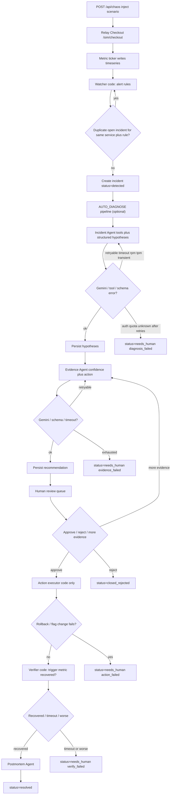
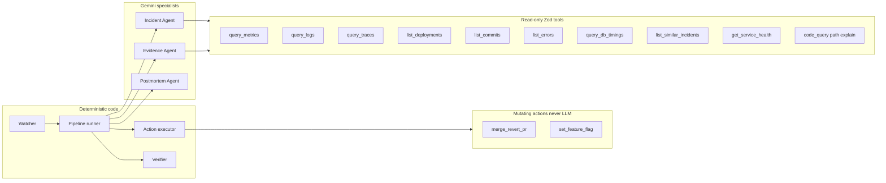
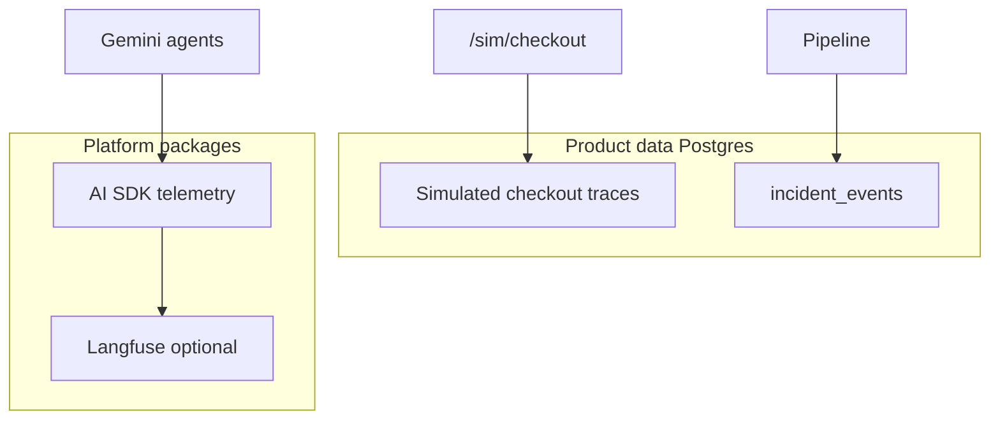

# Relay Incident Agent — architecture

Gemini specialists via the Vercel AI SDK tool loop, orchestrated by a **deterministic** pipeline. Human review gates all mutations. Observability uses Langfuse/OpenTelemetry — not homemade APM spans.

## 1. End-to-end incident loop

## 2. Agents vs code vs tools

Detection opens `detected` then optionally kicks `AUTO_DIAGNOSE` (default on). Humans still gate every mutation.

## 3. Observability layers

## 4. Code graph scope

Agents query `services/relay-checkout/graphify-out/graph.json` with a token budget and prefer live `read_source` / `diff_deploys` at the GitHub deploy SHA. `.graphifyignore` excludes `node_modules`, lockfiles, and `graphify-out` rebuild noise. The Next.js dashboard itself is never indexed.
